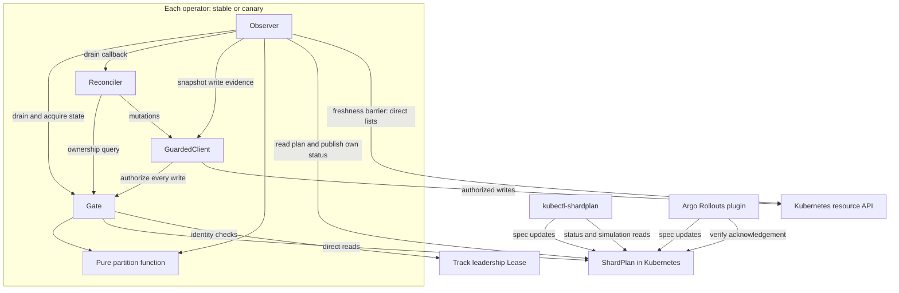
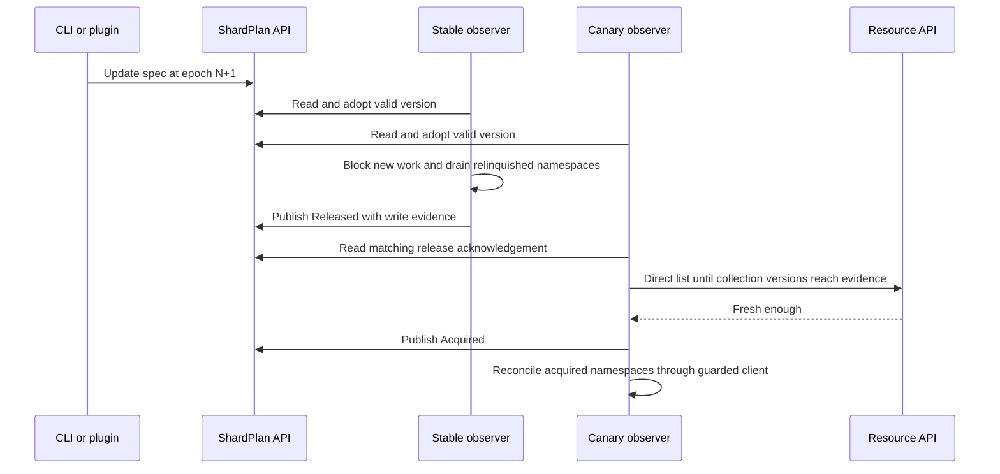

# Architecture

Shardkit is a library embedded in each operator revision, plus tools that
write a shared `ShardPlan`. Stable and canary run the same coordination
protocol with different track and revision identities.

## Components and data flow

The arrows show calls and data dependencies, not a single request's execution
order. The operator box exists independently for each track. Each observer
writes only its own status entry; the plan carries both tracks' acknowledgements.

| Component | Responsibility | Source |
|---|---|---|
| Typed API | Plan shape, validation, epoch and transition rules | [api/v1alpha1](../api/v1alpha1/shardplan_types.go), [validation](../api/v1alpha1/validation.go) |
| Partition | Deterministic namespace ownership and explanation, without cluster access | [partition.go](../pkg/partition/partition.go) |
| Gate | Adopt valid plan versions; check ownership, revision, leadership, and handoff state | [gate.go](../pkg/shardkit/gate.go) |
| Guarded client | Recheck authorization on mutations and record resource-version evidence | [client.go](../pkg/shardkit/client.go) |
| Observer | Drain, publish release evidence, wait for acquisition, and refresh status | [observer.go](../pkg/shardkit/observer.go), [status.go](../pkg/shardkit/status.go) |
| Freshness barrier | Wait for direct collection reads to reach released write versions | [freshness.go](../pkg/shardkit/freshness.go) |
| CLI and plugin | Drive plan transitions; expose ownership and rollout progress | [CLI](cli.md), [plugin](argo-plugin.md) |

## A handoff

This example shows namespaces moving from stable to canary. Each observer
also handles its own released and acquired sets; abort moves ownership back
through the same protocol. Failed drain, stale acknowledgements, or a failed
freshness barrier keep the affected work blocked. See the
[safety model](safety-model.md) for the precise invariants and residual windows.

## Write ownership and retries

Spec writers construct updates from live plans and increment the epoch.
The plugin retries resource-version conflicts up to three times, resolving
the rollout binding and validating the newly read plan each time. It changes
only the requested fields on a copy of that plan, preserving concurrent
metadata and other spec edits. A concurrent writer that already reached the
desired state makes the retry a no-op. Plugin API calls have a 30-second
context deadline covering all attempts; failures return to Argo for a later
reconcile.

Observers publish their own status entries with conflict handling, while
preserving the other track's entry and deletion-budget state. The guarded
client tracks completed live writes for release evidence. Shadow dry-runs
record attempted operations but contribute no persisted-write evidence.

## Integration and safety boundaries

Use the gate to decide which work to enqueue or reconcile, and route every
mutation through the guarded client. An earlier ownership query does not
replace the check at the write boundary. The observer's drain callback must
wait for the operator's in-flight work to finish before release is published.

The API reader used for plan checks and freshness barriers must be direct;
a cache cannot prove its own freshness. Leadership leases and revision
identity bind acknowledgements to the intended running operator. Confirmed
deletes additionally read the object directly, charge configured budgets,
and use a UID precondition to avoid deleting a replacement object.

These are cooperative controls. A controller using an unguarded client can
bypass them; Shardkit does not provide distributed storage fencing or replace
Kubernetes RBAC. The [onboarding guide](onboarding.md) shows the integration,
and the [webhook guide](webhook.md) explains optional admission validation.
